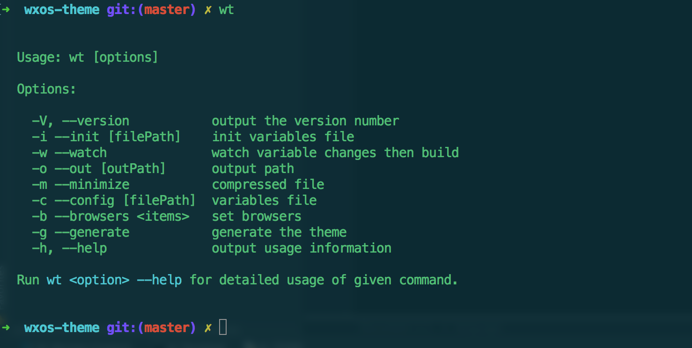

# wxos-theme

> Theme generator cli tool for Wxos.




## Installation
install local or global
```shell
npm i wxos-theme -D
```

install `wxos-ui`
```shell
npm i wxos-ui
# or from github
npm i https://github.com/yinshipeng/wxos-ui
```

## CLI
```shell
# init variables file
wt --init [file path]

# watch then build
wt --watch [--config variable file path] [--out theme path]

# build
wt -g [--config variable file path] [--out theme path] [--minimize]
```

## Node API
```javascript
var wt = require('wxos-theme')

// watch mode
wt.watch({
  config: 'variables/path',
  out: 'output/path'
})

// build
wt.run({
  config: 'variables/path',
  out: 'output/path',
  minimize: true
})
```

## Options
### config
Variable file path, default `./wxos-variables.css`.

### out
Theme output path, default `./theme`.

### minimize
Compressed file.

### browsers
set browsers, default `['ie > 9', 'last 2 versions']`.

### watch
watch variable file changes then build.

### components
A lists of components that you want to generate themes for.  All by default.

## License
MIT
